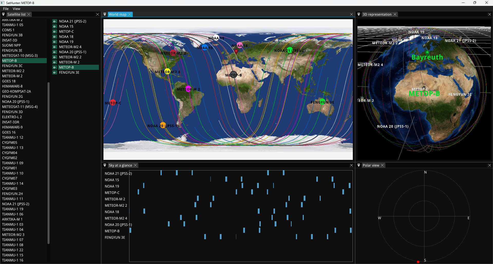
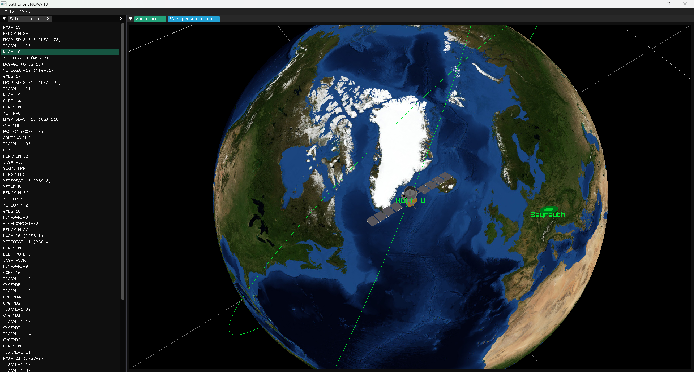

# SatHunter

**Advanced satellite tracking program 🛰️**





[](https://opensource.org/licenses/MIT)

ℹ️ SatHunter is the continuation of [gl-tracker](https://github.com/Politofr09/gl-tracker), another tracking program I made in go.

[Features](#features) - [Usage](#usage) - [Compiling](#compiling-yourself)

# Features
- `3D` orbit visualisation
- Configurable ground station and label
- Configurable TLE url list
- ImGui user interface
- TLE fetching and caching
- Geodetic map view

# Usage
- Press `F1` to swap between following the satellite to third person camera.

- Click the satellite you want to select on the `Satelite list` window.

# Compiling yourself

## Windows (MSVC)
Just open the CMakeLists.txt in visual studio.

## Linux (MSVC)
Run the following at the root of the repository
```sh
mkdir build
cd build
cmake ..
make
```
